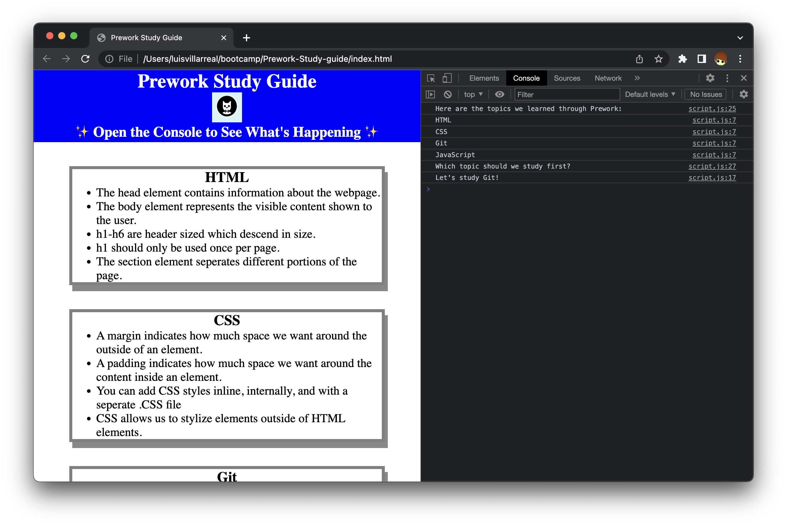

# Prework Study Guide Webpage

## Description

I created this webpage as prework to a coding bootcamp. I have learned how to code in Java before so much of the content in this project was either easy to learn or I already had previous knowledge. Though creating it did throw me into the world of web development quite well.

## Installation

N/A

## Usage

This webpage can be used to read notes on each topic on the user facing portion. You can also open the console using devtools and a few short messages will appear, some messages will change each time the webpage is refreshed!

## Credits

N/A

## License

Refer to License in repo.
